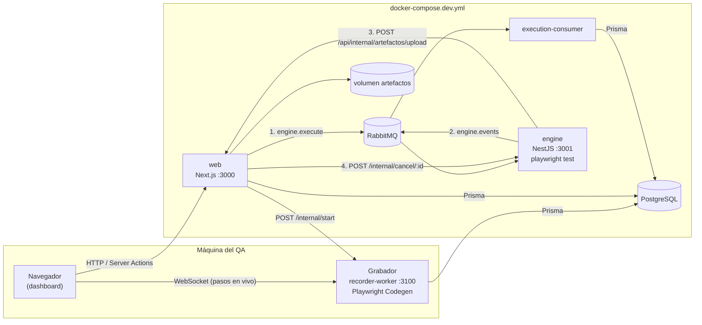
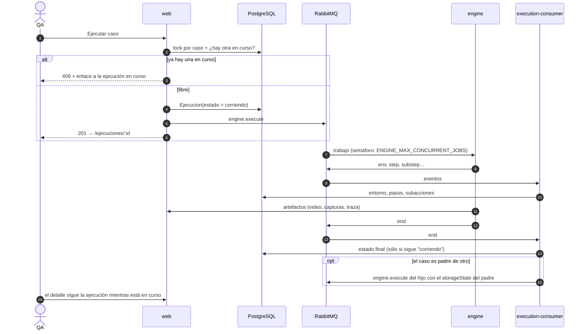
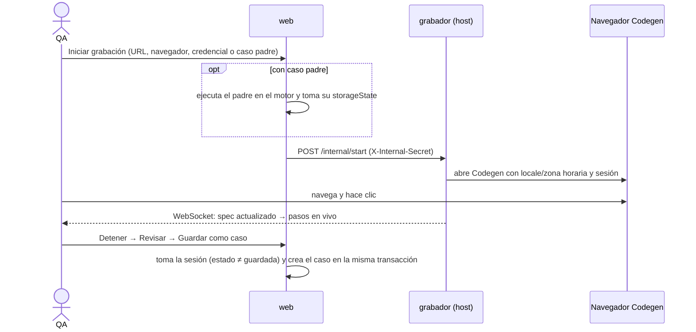

# Arquitectura

vorTest separa **quién decide** (la web, con la base de datos) de **quién ejecuta** (el motor, sin base de datos). Se comunican sólo por cuatro canales, todos explícitos.

> Tecnologías, versiones e imágenes: [componentes](./componentes.md). Detalle de cómo corre una ejecución: [motor de ejecución](./motor-de-ejecucion.md).

## Servicios

| Servicio | Imagen | Rol |
|---|---|---|
| `postgres` | postgres:16-alpine | Única base de datos. |
| `rabbitmq` | rabbitmq:3-management-alpine | Broker (5672, consola en 15672). |
| `web` | `vortest-web/Dockerfile.slim` | Next.js. Aplica migraciones y semilla al arrancar. Renderiza el Acta en PDF con Chromium headless. |
| `execution-consumer` | `vortest-web/Dockerfile.slim` | `scripts/execution-consumer.ts`: consume `engine.events` y escribe pasos, resultados y artefactos en la base. Encadena casos padre → hijo. |
| `engine` | `vortest-engine/Dockerfile` | Recibe trabajos, escribe el script a disco, lanza `playwright test` con un reporter propio y publica eventos. |
| grabador | host (`make recorder`) | `scripts/recorder-worker.ts`: abre Codegen en el escritorio, emite los pasos por WebSocket y guarda la sesión. No corre en Docker: necesita pantalla. |

## Los cuatro canales web ↔ motor

1. **Trabajo** → cola `engine.execute`. El mensaje es un `ExecuteJobMessage` con el script ya preparado (sin rutas locales del grabador, con el hook que guarda el `storageState`), el navegador y el `storageState` de entrada. Va envuelto como `{ pattern, data }` porque el motor usa el `ClientProxy` RMQ de NestJS; un mensaje sin ese sobre se descarta en silencio. Se construye siempre con `lib/ejecuciones/dispatch.ts::buildExecuteJob`.
2. **Eventos** → cola `engine.events`: `env`, `step`, `substep`, `log`, `assertion`, `captura-test` y `end`. El reporter (`vortest-engine/scripts/my-reporter.js`) los emite por stdout con un prefijo centinela; el motor los valida y publica.
3. **Artefactos** → `POST /api/internal/artefactos/upload`, con el encabezado `X-Internal-Secret`. Se verifica el SHA-256 y el tamaño en el streaming; el archivo se guarda con el prefijo del hash para que dos `video.webm` no se pisen.
4. **Cancelación** → `POST {ENGINE_INTERNAL_URL}/internal/cancel/:ejecucionId`. La web marca `cancelado` de forma optimista; un 404 del motor sólo significa que esa réplica no tenía el trabajo.

El motor **nunca** accede a la base de datos ni monta el volumen de artefactos.

## Ciclo de vida de una ejecución

Detalles que sostienen la robustez:

- **Un caso no corre dos veces a la vez**: `pg_advisory_xact_lock(hashtext(casoId))` y el conteo de ejecuciones en curso van en la misma transacción.
- **El `end` no pisa una cancelación**: el consumidor sólo aplica el resultado si la fila sigue en `corriendo`; el watchdog usa la misma condición.
- **El hijo se despacha una sola vez**: se toma `pendingChildEjecucionId` con un compare-and-set antes de publicar.
- **Eventos venenosos**: un evento que falla se reencola hasta cinco veces y luego se descarta con registro, para no bloquear la cola.
- **El script no ve secretos**: el proceso de Playwright recibe una lista blanca de variables (`PATH`, `HOME`, `PLAYWRIGHT_*`…), nunca `RABBITMQ_URL` ni `ENGINE_INTERNAL_SECRET`.
- **Lo tecleado en campos de clave** se enmascara en el reporter antes de llegar a la UI o al Acta.

## Grabación

El `spec.ts` que escribe Codegen es la fuente de verdad del caso; los `PasoGrabado` son sólo una lectura para mostrar.

## Autorización

Toda la autorización pasa por `vortest-web/lib/auth.ts`:

- `getUsuarioActual(session)` devuelve `null` si el usuario fue borrado o suspendido.
- Las acciones empiezan con `requireSuperadmin`, `requireEspacioAdmin` o `requireProyectoAccess`.
- Los listados se filtran en el servidor con `scopeEspacioWhere` / `scopeProyectoWhere`; un usuario `null` nunca lista sin filtro.
- Las rutas usan `withAuth` y convierten errores con `mapErrorToResponse` (403/404 en vez de 500).

| Rol | Alcance |
|---|---|
| superadmin | Todo. Único que gestiona espacios, credenciales y usuarios admin. |
| admin | Los espacios a los que fue asignado: proyectos, casos, ejecuciones y testers de esos espacios. |
| tester | Sólo los proyectos a los que fue asignado: casos y ejecuciones. |

## Seguridad de la plataforma

- Sesión con `iron-session` (cookie `vortest_session`, `SameSite=Strict`).
- Límite de intentos de login por email normalizado: 5 intentos fallidos bloquean ese email 15 minutos.
- `from` del login sólo acepta rutas internas.
- CSP aplicada; orígenes externos permitidos: Monaco (jsDelivr) y la fuente de íconos (Google Fonts). Sin `X-Powered-By`; HSTS en producción.
- Credenciales (`storageState`) cifradas con AES-256-GCM y una clave propia (`CREDENCIALES_ENCRYPTION_KEY`).
- El visor de trazas se sirve desde la propia app: la evidencia no sale a un sitio externo.

