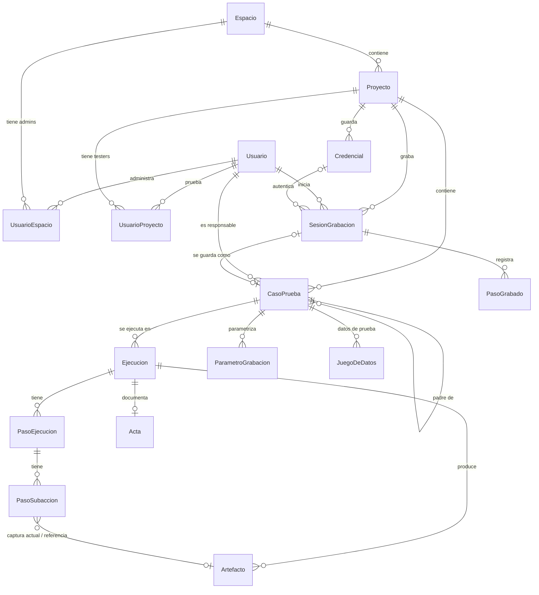

# Modelo de datos

Fuente de verdad: [`vortest-web/prisma/schema.prisma`](../vortest-web/prisma/schema.prisma). PostgreSQL 16, Prisma 6.

## Entidades

| Entidad | Qué representa | Notas |
|---|---|---|
| `Usuario` | Persona con acceso. | `rol`: `superadmin` · `admin` · `tester`. `activo = false` es "suspendido": no puede iniciar sesión y su sesión vigente deja de valer. |
| `Espacio` | Cliente o área de trabajo. | `color` identifica al espacio en la interfaz. |
| `UsuarioEspacio` | Admin asignado a un espacio. | Sólo el superadmin asigna. |
| `Proyecto` | Aplicación bajo prueba dentro de un espacio. | `ambiente` (QA, PROD…), `versionSistema`, `activo`. |
| `UsuarioProyecto` | Tester asignado a un proyecto. | |
| `CasoPrueba` | Un script de Playwright. | `origen`: `subirScript` · `grabador` · `mixto`. `script` es el `spec.ts` completo. `parentCaseId`: caso que se ejecuta antes (típicamente un login) para heredar su sesión. `codigo` único por proyecto. |
| `Ejecucion` | Una corrida de un caso. | `estado`: `pendiente` (en cola) · `corriendo` · `paso` (Conforme) · `fallo` (No conforme) · `errorMotor` · `cancelado`. Guarda navegador, entorno, aserciones y el `storageState` resultante (nunca se envía al navegador del usuario). `pendingChildEjecucionId` es plomería interna del encadenamiento. |
| `PasoEjecucion` | Un `test()` dentro del script. | `estado`: `paso` · `fallo`. `videoInicioMs`/`videoFinMs` arman los capítulos del video. Único por `(ejecucionId, numero)`. |
| `PasoSubaccion` | Una acción dentro del paso (clic, llenado, navegación, aserción). | Puede tener captura actual y de referencia. |
| `Artefacto` | Archivo de evidencia. | `tipo`: `video` · `captura` · `trace`. Se deduplica por SHA-256. Vive en `/app/storage/artefactos`. |
| `Acta` | PDF de evidencia de una ejecución. | 1 a 1 con `Ejecucion`. `consecutivo` único (ACE-AAAA-NNNN); regenerar un acta conserva su número. |
| `ConsecutivoAnual` | Contador de actas por año. | |
| `Credencial` | Sesión iniciada (`storageState` de Playwright) de un proyecto. | `valor` cifrado con AES-256-GCM. Sólo superadmin. |
| `SesionGrabacion` | Una grabación con Codegen. | `estado`: `iniciando` · `activa` · `pausada` · `detenida` · `guardada` · `descartada` · `error`. `specCode` es la fuente de verdad del caso que se guarde. |
| `PasoGrabado` | Lectura de una línea del `spec.ts` para mostrarla. | No se usa para regenerar el script. |
| `ParametroGrabacion` | Valor parametrizable de un caso (`{{nombre}}`). | `origen = credencial` no se puede editar. |
| `JuegoDeDatos` | Conjunto de valores para los parámetros de un caso. | |
| `IntentoLogin` | Contador del límite de intentos de login. | Clave: SHA-256 del email en minúsculas. Ventana de 15 minutos, 5 intentos. |

## Reglas de borrado

- `Proyecto` → `Credencial`: `Restrict` (no se borra un proyecto con credenciales).
- `Credencial` → `SesionGrabacion`: `SetNull` (los casos grabados con ella siguen existiendo y se ejecutan sin esa sesión; la pantalla de Credenciales lo advierte).
- `Acta` → `Ejecucion`: `Restrict`.

## Índices pensados para las consultas frecuentes

| Índice | Consulta |
|---|---|
| `Ejecucion(createdAt)` | Listado de ejecuciones, más recientes primero. |
| `Ejecucion(casoPruebaId, estado)` | ¿Hay una ejecución en curso de este caso? |
| `Ejecucion(casoPruebaId, finAt)` | Última ejecución terminada de cada caso (estado del caso, métricas). |
| `Ejecucion(estado, inicioAt)` | Watchdog de ejecuciones colgadas. |
| `PasoSubaccion(pasoEjecucionId, numero)` | Subacciones de un paso, en orden. |

## Migraciones

- Todas las migraciones se versionan en `vortest-web/prisma/migrations/`; `web` las aplica al arrancar (`prisma migrate deploy`).
- En entornos no interactivos (CI, agentes), `prisma migrate dev` no puede responder su confirmación de pérdida de datos: se escribe el SQL a mano (o con `prisma migrate diff --from-schema-datamodel … --to-schema-datamodel … --script`) en `prisma/migrations/<timestamp>_<nombre>/migration.sql`.
- Una migración que pierde datos necesita aprobación explícita antes de aplicarse.
